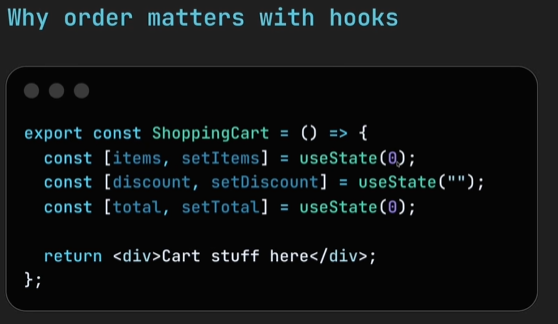
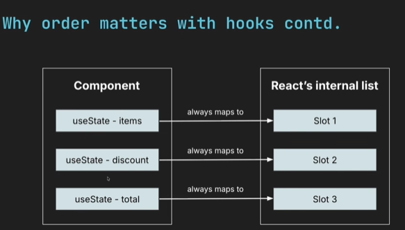

## export and export.default()

Using the `export` requires you to import using braces `{ variable }` so the variable can't change its name when importing
unlike `export default` which allow you to change it since is just the `varaible`

## Why JSX is important

Creating elements without our typical `.jsx` is a mess.
Example: To create, an element with the JSX syntax, you'd have to do

```javascript
React.createElement(div, { id: "container" }, "hello jerry");
```

#### without JSX

```javascript
import React from "react";

export const CardWithoutJsx = () => {
  return React.createElement(
    "div",
    { id: "card" },
    React.createElement("h2", null, "Welcome"),
    React.createElement("p", null, "This is a paragraph with text"),
    React.createElement("button", null, "without JSX"),
  );
};
```

## JSX rules

- All jsx code must closed. we can't have

```javascript
<input type="email">
```

The correct way is

```javascript
<input type="email" />
```

What does the web do when it see react fragments that causes to disappear

`<>
</>`

- every single tags in `JSX` is always closed
- What is the mechanism used to transform JSX back to HTML
- Do all componet already have a prop immediately they are created

when reusing a props is better to used the spread operator `...` than reassingig them

````javascript
<UserInfo name={name} age={age} city={city} email={email}  />


// Do this instead

<UserInfo {...props}  />

### Props Pattern

```javascript
  <CardWrapper title="Nesting Items inside props" >
        <p>Designing files </p>
        <button>inside props</button>
    </CardWrapper>
````

the above is possible since the `p` and `button` tag get appended into children props, which is used to append children

```javascript
export const CardWrapper = ({ title, children }) => {
  return (
    <div className="card">
      <h1>{title}</h1>
      <div className="card-content">
        Nested Content goes here
        {children}
      </div>
    </div>
  );
};
```

- can we use `forEach` to render items in React

- why should every child class have a unique key

```
installHook.js:1 Each child in a list should have a unique "key" prop.
```

Conditional Rendering- is how we make our components show different content based on differrent conditions

Ways of doing conditional rendering

- use of if statement
- use of ternary operators
- AND (&&) logic
- use of varaibles for complex logic
- Activity component (React 19.2)

## React keys

key is a special prop react uses internally, it's used when rendering list to tell different list apart

```
Example: if react already sees this
key=1 → Laptop
key=2 → Phone
key=3 → Mouse

and it gets  updated, to avoid rebuilding it from scractch
key=1 → Laptop
key=4 → Keyboard
key=2 → Phone
key=3 → Mouse
```

react uses key to tell know which element was newly added to the list and which already exists
So if item was added, removed or reordered

### Without keys

Image we have a list

```html
<ul>
  <li>David</li>
  <li>backend</li>
  <li>clean code</li>
  <ul></ul>
</ul>
```

it needs to be updated to

```html
<ul>
  <li>David</li>
  <li>Samuel</li>
  <li>backend</li>
  <li>clean code</li>
  <ul></ul>
</ul>
```

without keys, `React` thinks every item there is new i.e

```
David updates to  David
backend updates to  samuel
cleancode updates to  backend
---- updates to clean code
```

with keys `React` compares the previous items with the new ones and updates only updates the new ones reducing work.

```
Example: there 4976 list items and i want to add 1 more item, without keys i would have to update it 4977 times as opposed to once with keys
```

## Styling React Component

How do we style components in react
the `{}` in `style={}` is to for javscript
and the `{{}}` in `style={{}}` is for javascript objects which looks like css but has to be modified in terms of syntax (camelCase)

```javascript
export const Alert = ({ children }) => {
  return (
    <div
      style={{
        backgroundColor: "hsl(0,100%,20%)",
        border: "1px solid red",
      }}
    >
      {children}
    </div>
  );
};
```

There are several methods for styling

- inline - which become inefficient as the app grows
- external styling - results to naming conflicts as a the `.css` file is reuseable anywhere in the project
- Css Modules - you'd have to rename your file from `file.css` to `file.module.css` and its importation shifts from `import './Alert.css'
` to `import styles from './Alert.module.css'
`
  We understand styling well because we've used in the typical `.css`

## Css Module

Helps prevent naming conflicts.

if you have two buttons in the same file `button1` and `button2` to style them differently, you'd have to have different classNames for them in the same CSS file.

You could style the first one as `.button1` and `.button2` but if there are 45 diffent shades of button it becomes messy coz, your `CSS` now contains 45 different styles for button.

The best thing is to create a `.module.css` file and keep just a single class name `.button` accross your buttons. That single module file has the styles for the different types of button you might have `alert`, `failed`, `successful`, `default` etc, they would be difined in one file.

Once the styles are applied they are scoped into that button, and you can move them around without having them overwritten

The default way is

```javascript
import styles from 'filename.module.css`
```

i noticed something crazy that happen when i used the External styling.

I created a button on two different files they use same `.button` name and one style `overwrote` the other

I have a `.login.css` which i where is wrote the button and created another button in `.dashboard.css` and they both have same name, since they are both global, one overwrote the other.

So i made `.login.css` become `.login.module.css` so the style feels embeded into it and so the global style cannot sit on it now

## Event Handling

Event handling is how react responds to change i.e clicked a button, pressed a key .
We have three things `Event`, `Event object` and `Event handler`

- `Event` - this is the action happend i.e clicked a button, pressed a key, so the `onClick`, `onChange`, `onSubmit` are called `event types`
- `Even object` - is the changes that would result from what you did. You could set you event object to `console.log(...)` or something else. What will happen when that event object is triggered is the `event object` and it's usually declared in the function which `handles`

- `Event handler` - is the function that calls the `event object`

what are their differences

- `{ handleClick }`
- `{ handleClick()}`
- `{ () => handleClick }`
- `{ () => handleClick() }`

Responding to events is a two-step process

1. Define the function to be executed when event occurs
2. Then you assign the function to a special `prop` that starts with `on` e.g `onClick()`, `onChange()`

- So handling events is all about passing function to special props like `onClick`
- Remeber not to call it you just pass it unlike HTML

```HTML
<button onclick="handleClick()">Click me</button>
```

There are other event handler you can try out like: `onSubmit` - forms, `onMouseEnter`, `onMouseLeave`, `onKeyDown`, `onKeyUp`, `onFocus` - input receives focus, `onBlur` - input loses focus

## Event handlers as props

We might want to reuse a component in multiple places, for example: a button might be used as `contact button` and `subscribe button` but you'd want them to perform different actions

Each component receives the `event handler` as a prop and decides what `event object` should be produced when we click

We do this:

```javascript
export const ActionButton = ({ text, onClick }) => {
  return <button onClick={onClick}>{text}</button>;
};
```

So what happend here is when you click on the button `onClick={onClick}` the second `onClick` is the function which is `event handler`

The `event hanlder` was passed into the `event` as an argument to be handled differrently by each component, since they would produce differrent result

I handled place we used the `Event handler` as prop was here

### Menu

```javascript
import { MenuItem } from "./MenuItem";
export const Menu = () => {
  const handleOrder = (itemName, itemPrice) => {
    console.log(`You bought ${itemName} for $${itemPrice}`);
  };
  return (
    <div>
      <h2>Menu</h2>
      <MenuItem name="Pizza" price={23.22} onOrder={handleOrder} />
      <MenuItem name="Spring rolls" price={45.2} onOrder={handleOrder} />
      <MenuItem name="Turkey" price={123.22} onOrder={handleOrder} />
    </div>
  );
};
```

### MenuItems

```javascript
export const MenuItem = ({ name, price, onOrder }) => {
  return (
    <div>
      <span style={{ margin: "30px" }}>
        {name} - ${price}
      </span>
      <button
        onClick={() => onOrder(name, price)}
        style={{ padding: "5px 10px" }}
      >
        order
      </button>
    </div>
  );
};
```

- We created a `Menu` and passed the `Menu items` into the menu
- The main part is where we trigger the `onClick` the parent `Menu` calls the `handleOrder` function

## State - useState

State is a component's memory, it's a special data that

- Triggers a re-render when it changes (solving our screen update problem)
- Presists between renders (solveing our reset problem)
  because react renders from top to bottom on every render variable could be reinitialized instead of being persistent

the `[currentvalue, setterFunction] = useState(initialValue)`

Lazy initialization - to initialize on when you need it
it's used when

- reading values from localStorage
- Feting from API
  you might have created a variable for it but you only want to intialize it when you receive it

```javascript
import { useState } from "react";

export const LoginCard = () => {
  const [message, setMessage] = useState();

  const handleChange = (e) => {
    setMessage(e.target.value);
  };
  return (
    <>
      <div>
        <h2>{!message ? "Text displays Here" : message}</h2>
        <input
          type="text"
          placeholder="Enter your message..."
          value={message}
          onChange={handleChange}
        />
      </div>
    </>
  );
};
```

- first note the `input` has parameter called `value`
- you set the initial value of `message` to it
- you use the `handleChange` to change the `message` and with what's in the input
- which in turn updates the screen

### Summary useState

- it returns two items and we do use array destructuring to received them `[currentValue, setterFunction]`
- We can have multiple state variable each managing its own data

## Rules of hooks

**Rule1:** only call hooks at the top level of your function, not inside`loops`, `condition`, `nested function` or `try/catch blocks`

**Rule2:** only call hooks from react functions from react components and custom hooks

### Order of hooks

React uses the order in which hooks appear to render them, and any changes to that order as a result of `condition` would result in error



React doesn't track hooks by their name but by the order they appear, so you can think of:

```
hook #1 -> items
hook #2 -> discounts
hook #3 -> total
```

So when it renders it does it in order they appear.

That's why react flags you anytime you have hooks in `condition`, `nested function` etc

if `hook #2` was declared in a condition and on render the condition is false that hook isn't created, so `hook #2 - total` so the value discount might be set to total now
because when a contition isn't true the hook isn't rendered



#### Ways of breaking the ordering or hooks rule

- Declaring hooks in loops
- hooks after early return

```javascript
export const userProfile = ({ userId }) => {
  if (!userId) {
    return <div> Please log in </div>;
  }

  const [profile, setProfile] = useState(null);
};
```

if the first `userId` is false then the hook `profile` isn't created

- Hooks in event handlers

We don't have to manually detect the hooks errors, the `eslint-plugin-react-hooks` handles that

All these are reasons hook should be declared at top level and not declared in `conditions`

## React hooks cannot be used in regular javascript function

Regular javascript function are functions that do not return `JSX` i.e they are not components

#### Regualar JS function

```javascript
function calculateTotal() {
  const [total, setTotal] = useState(0);
}
```

React hooks are supposed to be used when rendering a component

```javascript
function App() {
  const [count, setCount] = useState(0);

  return <button>{count}</button>;
}
```

## How update works

- Trigger phase - simply tell react that `something has changed in. you need to render this component again` and then queues the update(s) in the updater queue
- Render phase - react figures out what needs to be updated, by going through the updater queue to retreive the final value
- commit phase - react changes the component that requires update

### How setCount update works

1. You call the `setCount(count + 1)` triggers phase
2. React marks your component as needing an update
3. React calls your component function
4. you function returns the JSX with the updated
5. React compares this render with the previous one and figures out what changed
6. React compares and updates only the portion that changed in the DOM

Example:

```javascript
const handleClick = () => {
  console.log(`Before: ${count}`);
  setCount(count + 1);
  console.log(`After: ${count}`);
};
```

The result are :

```
Before: 0
After: 0

and not
Before: 0
After: 1
```

### My initial explanation

- Remember when we said `hooks` are only used in `components` i.e functions that returns `jsx`
- When we click the button, the Setter function `SetCount(count + 1)` doesn't actually update `count` immediately until it renders a `component`

Since the `return` state that renders the component are the last things `count` remain the same until the next render

```javascript
 <div>
    <h2>Count: {count}</h2> // <- updates
    <button onClick={handleClick}>increment</button>
    {console.log(count)}   // <- updates
</div>
```

### Actual explanation

React undergoes a `trigger -> render -> commit` phase to update

- App is rendered
- we click the button
- it runs the entire code
- it then encounters `setCounter(count+1)`
- it stores it in the updater queue as `setCounter(0+1)`, `setCounter(0+3)`, `setCounter(0+4)`
- the event handler completes
- we enter the `render` phase
- it first loops through the updater queue and evaluates the new state of `count`
- here is calls the `Counter()` component again with `count = 4`
- it loop though the queue to evaluate the current value for `count`
- commit phase it updates `count` in the component
- waits for another click

## State as a snapshot

```javascript
const handleClick = () => {
  setCount(count + 1);
  console.log(`After: ${count}`);
  setCount(count + 3);
  console.log(`After: ${count}`);
  setCount(count + 4);
  console.log(`After: ${count}`);
};
```

- whenever we encounter `setCount(count+1)` it simply tell react that on the next update use `count = i`, $i = \{1,3,5\}$ but we haven't enter the next update yet so count is still `0` so `After: 0`

- Since `count = 0` because we are not yet to update `setCount(count + 3)` tells react on the next update use `count = 3`

and so on, but the last one is the on that is picked `setCount(0+4)` tells react use `count = 4` in the next update

## Updater Function

```javascript
const handleClick = () => {
  setCount((prev) => {
    console.log(`After: ${prev}`);
    return prev + 1;
  });
  setCount((prev) => {
    console.log(`After: ${prev}`);
    return prev + 3;
  });
  setCount((prev) => {
    console.log(`After: ${prev}`);
    return prev + 4;
  });
};
```

- App is displayed
- you click on the button
- enter the trigger phase
- updates `setCount(prev => prev+1)`,`setCount(prev => prev+3)`, `setCount(prev => prev+4)` are queued
- enter the render phase with `count = 0`
- loop through the updater queue
- evaluate the updater functions in the updater queue  
  `(0) => 0+1` `count = 1`  
  `(1) => 1+3` `count = 4`  
  `(4) => 4+4` `count = 8`
- still in render phase
- call the `Counter` component with `count = 8`
- enter commit phase
- render the DOM with `count = 8`

## Question

1. why was css module invented
2. how was it implemented
3. Why do value not update naturally in react and we always have to use the useState hook to update values
4. What's the essence of strictmode
5. What are hooks
6. in the counter project why does `++count` behave differently from `count++`
